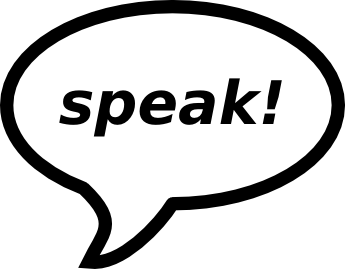

# Speech Projects

This repository contains projects to rehearse public speaking and other communication skills.

The speeches are best executed in a mutually supportive environment, e.g. a learners meetup or a professional speaking network, such as [Agora Speakers](http://www.agoraspeakers.org). As long as you make sure you have supportive people for feedback around, it can work almost anywhere.

See the subfolders for speech projects targeted to specific audiences.

## License

(c) 2016 Dr. Kristian Rother

This work is licensed under a Creative Commons Attribution-ShareAlike 4.0 International License.

See [www.creativecommons.org](https://creativecommons.org) for details.

## Contact

krother@academis.eu

