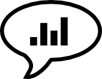

# Speech Projects for Data Scientists

As a Data Scientist, you are a key player connecting the fields of programming, statistics and business thinking. Communicating and presenting data, technologies, results and conclusions is key. This article contains five speech projects to rehearse communicating data science:

1. The Lightning Talk
2. The Live Demo
3. The Educational Session
4. Selling an Idea
5. The Project Presentation

For your learning sucess, **positive, supportive evaluations** are key. 
The speeches are best executed in a mutually supportive environment: a learners meetup, a [Data Science Boot Camp](http://www.datascienceretreat.com) or a professional speaking network, such as [Agora Speakers](http://www.agoraspeakers.org). As long as you make sure you have supportive people for feedback around, it can work anywhere.

## License

(c) 2016 Dr. Kristian Rother

This work is licensed under a Creative Commons Attribution-NonCommercial-ShareAlike 4.0 International License.

See [www.creativecommons.org](https://creativecommons.org) for details.

## Contact

krother@academis.eu

