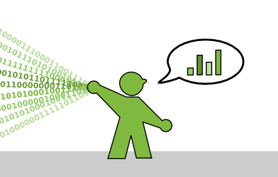

# Speech Projects for Data Scientists

## Who is this workbook for?

As a Data Scientist you are asked to present your findings in a convincing and effective manner to various cross-functional team members and decision makers. You are a key player connecting the fields of programming, statistics and business thinking. Communicating and presenting your data analytics results is a important skill that can be trained like a muscle. This workbook contains five exercises to improve your communications skills as a Data Scientist.

## The speech projects

This workbook contains five speech projects that will train your communication skills and excel your data science career:

1. [The Lightning Talk](https://github.com/krother/speech_projects/blob/master/data_scientists/lightning_talk.md)
2. [The Live Demo](https://github.com/krother/speech_projects/blob/master/data_scientists/live_demo.md)
3. [The Educational Session](https://github.com/krother/speech_projects/blob/master/data_scientists/educational_session.md)
4. [Selling an Idea](https://github.com/krother/speech_projects/blob/master/data_scientists/selling_an_idea.md)
5. [The Project Presentation](https://github.com/krother/speech_projects/blob/master/data_scientists/project_presentation.md)

For your learning sucess, **positive, supportive evaluations** are key. 
The speeches are best executed in a mutually supportive environment: a learners meetup, a [Data Science Boot Camp](http://www.datascienceretreat.com) or a professional speaking network, such as [Agora Speakers](http://www.agoraspeakers.org). As long as you make sure you have supportive people for feedback around, it can work anywhere.

## License

(c) 2016 Dr. Kristian Rother

This work is licensed under a Creative Commons Attribution-ShareAlike 4.0 International License.

See [www.creativecommons.org](https://creativecommons.org) for details.

## Contact

krother@academis.eu

