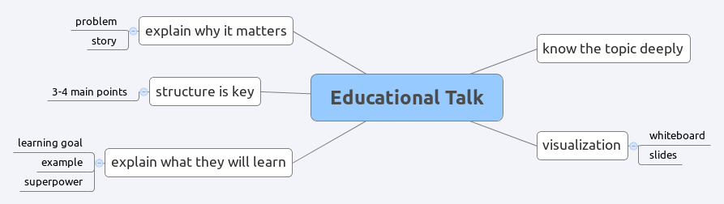

# The Educational Session

## Your Goal

**Give an informational talk to an audience of Data Scientists about a data science method, concept or technology you are familiar with.** In contrast to the lightning talk, this presentation should go into details. Focus on finding good visualizations that illustrate your message. These could include images to evoke emotions, charts and diagrams, data samples or even animations. Of course, you may decide not to use slides at all and to use a whiteboard (or something else) instead.

The key to a good informational talk is to state clearly at the beginning *why* your audience should care and *what* they will learn. You can achieve this by using an illustrative example, a little story or by telling people what *"superpower"* they are going to learn.

Use an aproppriate opening and finish with a clear conclusion repeating your take home message.

## Time

15-20 minutes

## Questions for evaluators

* How did the speaker show that the topic is *relevant* and *interesting*?
* How did the speaker structure the content?
* Was the density of information well-chosen?
* How did visualization help your understanding?
* What could the speaker do differently?
* What did you learn?

## Example Talk

* [Global population growth, box by box ](https://www.youtube.com/watch?v=fTznEIZRkLg) TED talk by Hans Rosling
