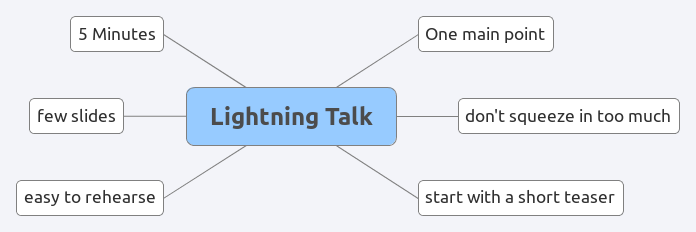

# The Lightning Talk

## Your Goal

Present a tool or technology briefly to other Data Scientists. Choose a tool that you are familiar with. It could be a mathematical concept, a programming language or library, a web tool or even one of your own projects.

The value of the lightning talk is its brevity. Your project is to summarize the essence of the tool: What is it good for, how does it look like, what pros and cons are there. If you want to show an example, choose one.

## Time

5 minutes

## Questions for evaluators

* Which part of the talk did you find the most interesting?
* Where there any parts that you found irrelevant?
* Did the speaker limit himself to one core idea, or were multiple ones covered.
* How did the speaker manage time during the talk?
* What could the speaker do differently?
* How would you summarize the core message in your own words?

## Extra Material

* [Giving a good lightning talk](https://www.software.ac.uk/home/cw11/giving-good-lightning-talk) by the Software Sustainability Institute
* [How to Give a Great Ignite Talk](http://scottberkun.com/2009/how-to-give-a-great-ignite-talk/) by Scott Berkun
* [16 Ways to Prepare for a Lightning Talk](https://www.semrush.com/blog/16-ways-to-prepare-for-a-lightning-talk/) by Kathleen Garvin

## Example Talks

* [How to Give a Lightning Talk](https://vimeo.com/57965823) Video by Steve Klabnik
* [Less Code == More Software](https://www.youtube.com/watch?v=XLsZkA77h8c) example talk by Peter Sommerland
