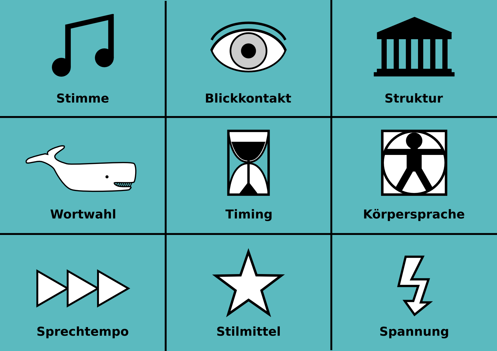

# Workshop Redebewertung

## Ziel

Alle Teilnehmer geben 1-2 Rednern Feedback mit **9 Bewertungsrollen** wie *Blickkontakt*, *Sprechtempo*, *Struktur* usw. Dabei übt jeder:

* als Rednerin/Redner erfährst Du viel verschiedenes über Deinen Vortrag.
* als Bewerter übst Du Deine Beobachtungsgabe und Deine Beobachtung zusammenzufassen.
* als Moderator trainierst Du, eine Gruppe mit vielen Teilnehmern zu koordinieren.

Dieser Workshop eignet sich auch für unerfahrene Moderatoren, da der Ablauf fest vorgegeben ist.

## Dauer

45-90 Minuten

## Vorbereitung

Im Vorfeld gibt es zwei Dinge zu erledigen:

* finde 1-2 Redner, die eine Rede oder Präsentation von 5-15 Minuten Länge halten.
* zeichne 9 Karten für die **9 Bewertungsrollen**. Du kannst auch das Bild auf ein Blatt ausdrucken und zerschneiden.

## Durchführung

Der Workshop besteht aus folgenden Schritten:

| #  | Schritt | Zeit |
|----|---------|------|
| 1. | Teilnehmer begrüßen | 1-2' |
| 2. | erkläre den Ablauf  | 2-3' |
| 3. | lose die Bewertungsrollen mit den Karten aus | 3' |
| 4. | Redner/in ankündigen und aufrufen | 2' |
| 5. | vorbereitete Rede | 5-15' |
| 6. | nacheinander die Bewertungsrollen aufrufen (jeder 1-2') | 6-20' |
| 7. | **PAUSE** | 10' |
| 8. | Schritt 3.-6. für die zweite Rede wiederholen | 20-40' |
| 9. | Abmoderation und Schluß | 3' |

## Tips

* idealerweise ist die Rednerin/der Redner ähnlich erfahren wie die Teilnehmer.
* achte unbedingt darauf, daß die vorher vereinbarte Redezeit eingehalten wird.
* wenn Du als Moderator nicht so erfahren bist, laß auch Dir die Zeit anzeigen.
* wenn weniger Teilnehmer als Rollen da sind, laßt einfach einige weg. *Doppelbesetzungen sind kontraproduktiv, da die Bewerter sich dann nicht so gut konzentrieren können!*

## Hinweise zu den Bewertungsrollen

Hier sind einige Hinweise für die *Bewerter*. Du kannst diese gerne z.B. auf die Rückseiten der Karten schreiben.

### Stimme

* war die Rede gut zu verstehen?
* wurde die Stimmhöhe variiert?
* wie hat die Stimmmelodie zum Inhalt gepaßt?

### Blickkontakt

* hat der Redner einen Blickkontakt aufgebaut?
* wurden alle Personen im Raum angesehen?
* war der Blickkontakt mit Dir flüchtig oder unangenehm lang?

### Struktur

* Gab es einen erkennnbaren Anfangs- und Schlußteil?
* aus wie vielen Unterpunkten bestand der Hauptteil?
* wie wurden die Übergänge zwischen den Teilen deutlich gemacht?

### Wortwahl

* war die Rede grammatisch korrekt?
* was für Beispiele für gelungene Wortwahl findest Du?
* an welchen Stellen könnte der Wortreichtum verbessert werden?

### Timing

* hat die Rede den Zeitrahmen eingehalten?
* wie lang waren die Teile der Rede im Vergleich?
* gab es Beispiele für besonders gutes Timing?

### Körpersprache

* was für Gesten kamen in der Rede vor?
* wie haben diese zur Rede gepaßt?
* wie hat der Redner den Raum genutzt?

### Sprechtempo

* hat das Sprechtempo zur Rede gepasst?
* wurde das Sprechtempo variiert?
* wie wurden Pausen eingesetzt?

### Stilmittel

* wie würdest Du den Stil der Rede beschreiben?
* was für besondere Stellen hast Du bemerkt?
* hast Du rhetorische Stilmittel bemerkt?

### Spannung

* gab es überraschende Wendungen in der Rede?
* gab es eine Spannungskurve?
* welche Momente fandest Du besonders spannend?
