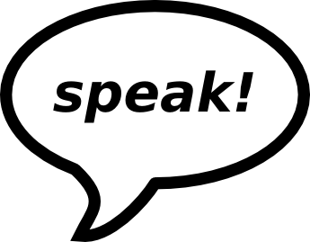

# Speech Projects

This repository contains projects to rehearse public speaking and other communication skills.

## What are these speech projects good for?

If you want to improve your speaking skills in a given area, or simply want to become better at giving presentations, there is a simple way: **speak!** Like good runners run a lot and good programmers program a lot, good speakers become good by speaking a lot.

The **speech projects** described here are stepping stones on the path of improving as a speaker. Each project consists of a speaking assignment focusing on one particular aspect of a speech, so that you can develop your skills in portions.

And, most importantly, **this is an exercise that is meant to be fun**.

## How to use the material?

It is a simple three-step process:

1. Find a place to speak.
2. Give the speech for one of the projects.
3. Collect feedback by someone who read the project description.

## Where to speak?

The speeches are best held in a mutually supportive environment, e.g. a learners group or a professional speaking network, such as [Agora Speakers](http://www.agoraspeakers.org). As long as you make sure you have supportive people for feedback around, it can work almost anywhere.

See the subfolders for speech projects targeted to specific audiences.

## License

Unless stated otherwise in the README.md file for a given folder, the content is licensed as follows:

(c) 2016 Dr. Kristian Rother

This work is licensed under a Creative Commons Attribution-ShareAlike 4.0 International License
**and** a Creative Commons Attribution-NonCommercial-ShareAlike 4.0 International License.

See [www.creativecommons.org](https://creativecommons.org) for details.

## Contact

krother@academis.eu

