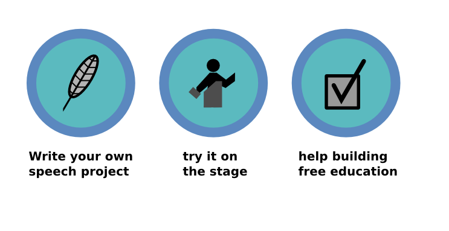

# Contributing

I want to build a collection of speaking exercises that speaking
clubs around the world can use for free. The educational material
covers **speeches, meeting facilitation,** and **workshops**. For this idea to become reality, **I need your help**.

## How to contribute?

* Sign up for e-mail updates
* Use a project and report your experience
* Review a project
* Write a project from scratch
* Translate a project

## What kind of project can I contribute?

There are a few border constraints

* beginner-friendly: do not require professional speaking experience
* do not require professional training experience
* time frame: up to 45 minutes
* self-sufficient materials
* self-assessment: it must be possible for an evaluator to give constructive feedback after the exercise

## Advantages

* You can adapt this material to your target audience.
* You can translate this material to your preferred language.
* You can build a custom manual/course out of it.
* The material is readily available.
