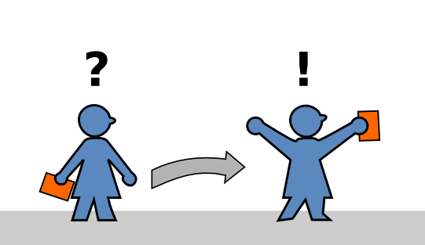

# Initial Speech & Facilitation Projects

This manual contains four simple projects to make yourself comfortable on the stage. It is intended to help you to embark on a learning path as a speaker.

## Document sources

Editable sources of this document can be found on [https://github.com/krother/speech_projects](https://github.com/krother/speech_projects).

## License

This work is licensed under a Creative Commons Attribution-NonCommercial-ShareAlike 4.0 International License.

See [www.creativecommons.org](https://creativecommons.org) for details.

## Authors

Written by Jörg Würster, Barbara Strauß, Harald von Treuenfels, Jasmin Touati, Kristian Rother, Raimo Graf, Sascha Goldmann and Schorsch Tschürtz.
