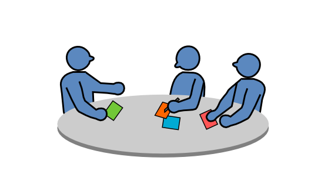
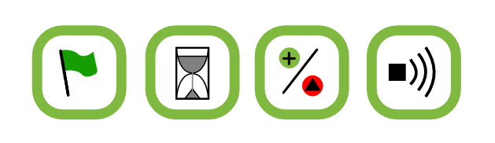

# Meeting Facilitator Roles

This document contains descriptions of roles that facilitate speaking club meetings. They have been developed and used in the Spreeredner speaking club ([www.spreeredner.de](http://www.spreeredner.de)). We hope they are useful in other public speaking organizations as well.

## License

This work is licensed under a Creative Commons Attribution-NonCommercial-ShareAlike 4.0 International License.

See [www.creativecommons.org](https://creativecommons.org) for details.

## Authors

Jörg Würster, Barbara Strauß, Harald von Treuenfels, Jasmin Touati, Kristian Rother, Raimo Graf, Sascha Goldmann, Schorsch Tschürtz
