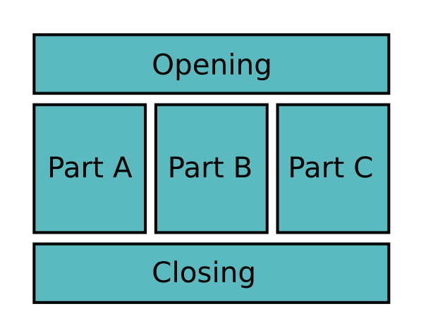

# Speech Structure

## Goal

Deliver a spech that is clearly divided into **opening**, **body** and **conclusion**.

## Background

Why does the structure of a speec matter? First, structure is crucial for making a speech understandeable for your audience. Second, it helps you to be aware how far your speech has proceeded. Finally, a solid structure serves as a backup plan: Even if a lot of things fall apart (no projector or presentation time cut in half), the structure helps you to make your point.

### The Opening

The opening of a speech needs to do one thing: *Whet appetite for the rest*. Tell a brief anecdote or explain how you got in contact with the topic. Announce what the speech is about, but don't spoil any surprises yet.

### The Body

The main part of a speech should contain 2-4 points. With more, the audience quickly gets lost. For understandability, transitions between each part should be clearly recognizeable. If you want to build in extra safety, you might announce the parts explicitly: *"My first point is..."*.

There are very many possibilities to structure the body of a speech. In this project, you may consider the following options:

* **Enumeration**: First point, second point, third point
* **Timeline**: Past, present, future
* **Comparison**: Proposal, alternative, conclusion (why the alternative is better)
* **Hero Journey**: Problem, Struggle, Climax

### The Conclusion

The conclusion should re-emphasize your main point. Again, you have multiple options here: A summary of what you said before is the easiest one. A call to action is a bit more difficult. A well-placed quote, story or final statement fit well at the very end. This way, your audience recognizes more easily that your speech is over (and that they may now applaude).

The focus of this speech project is to prepare a structure for your speech in advance and prepare the rest of the speech accordingly.

## Time

5-7 minutes

## Questions for Evaluators

* What did you like about the speech?
* How was the opening constructed?
* How were transitions between the parts achieved?
* What did the conclusion consist of?
* Was the time allocated for the parts well-balanced in your opinion?
