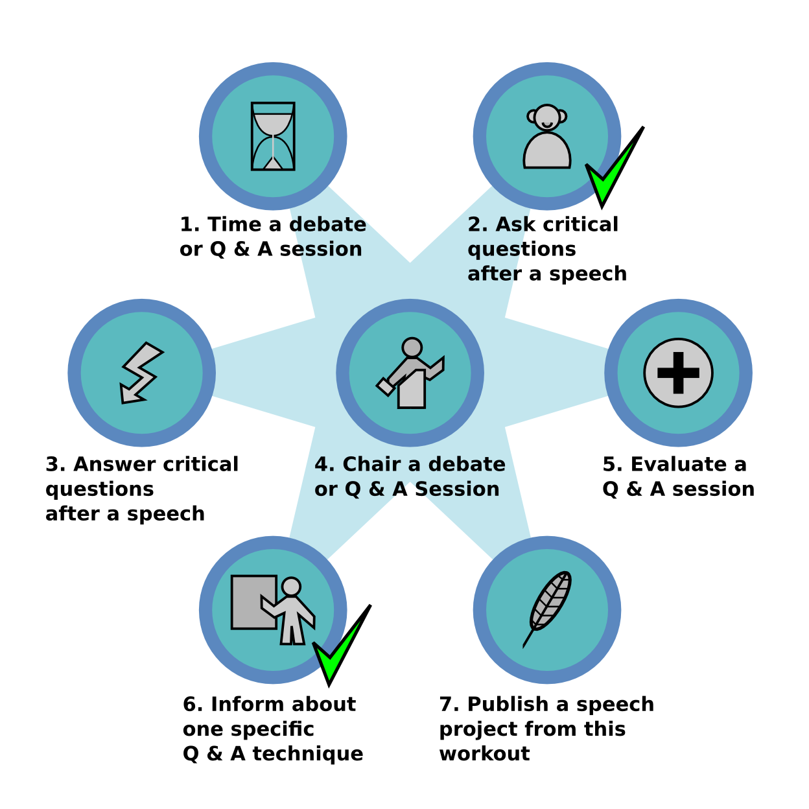

# Speech Workout - Dealing with Critical Questions

*my workout with 7 speech projects – by Kristian Rother*

## What is a speech project workout?

A series of 7 educational challenges that help you to improve your communication skills. 

## Why are you doing a workout on critical questions?

I find asking and answering difficult questions helps to improve my **critical thinking** skills. Also I find myself frequently in Q & A situations while *teaching* and *building communities*.

## What are the 7 projects?

1. Time a debate or Q & A session.
2. Ask critical questions after a speech.
3. Answer critical questions after a speech.
4. Chair a debate or Q & A session.
5. Evaluate a Q & A session.
6. Inform about one specific Q & A technique.
7. Publish a speech project from this workout.

## Where do these 7 projects come from?

I developed them with some help from my mentor and speaking club.

## Did you invent the idea of training communication by doing speech workouts?

No. Thousands of people have done similar things long before. **Ralph Smedley** is my closest point of reference.

## Where can I find details on the 7 speech projects?

Nowhere, there exists no written manual for this workout. But you are invited to [help me write one](https://krother.github.io/speech_projects/en/contributions.html).

## What do you do before you check off a project?

I ask someone from my speaking club for an evaluation and a signature.

## What do you get when you finish all 7 projects?

Knowledge. Experience. Recognition from my fellow club members and probably a small celebration afterwards. Also, the opportunity to plan the next 7 projects with my mentor.

## Wouldn't it be more challenging to have 7 speeches in the workout?

I believe communication is a very diverse skillset, and I want to rehearse **all** aspects of it?

## Why is there such a broad mixture of activities?

In my speaking club, we have **speeches**, **evaluations** and **moderation roles**. Having a mixture of them helps our club to balance the meeting roles.

## What is project 7 about?

Writing and publishing enhances the available [Open Source Speech Projects](https://krother.github.io/speech_projects/). If more people adopt the idea, the material becomes self-improving.

## Sounds great! Where can I read more about your projects?

Visit the [Speech Projects page](https://krother.github.io/speech_projects/) or sign up to the **mailing list** on the page.

## Sounds great! May I use the material?

Yes, please do! This workout is available under the CC-BY-SA 4.0 license. If you distribute copies, you need to attribute the author(s) and stick to the license. If you modify the work, simply add your name to the list authors.

## Sounds great! Can I help?

Yes! I welcome many kinds of contributions (new content, reviews, translations etc.). Please get in touch at [krother@academis.eu](mailto:krother@academis.eu).

## Sounds great! Where can I go to practice my communication skills?

There are thousands of **speaking clubs** worldwide! Here you find a list of all [speaking clubs in Berlin](http://www.academis.eu/posts/speaking_clubs_berlin).
