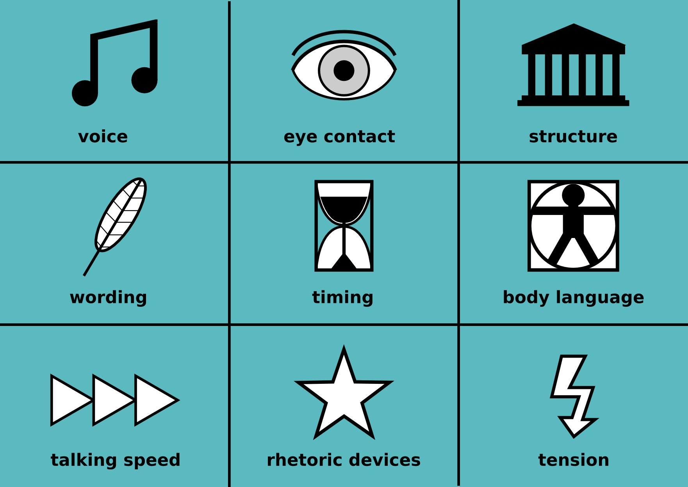

# Speech Evaluation Workshop

## Goal

All participants give feedback for 1-2 speakers according to **9 evaluation roles** such as *eye contact*, *talking speed*, *structure* etc. That way, everybody is rehearsing their skills:

* **Speakers** learn a lot about their own presentation.
* **Evaluators** train their ability to observe and to relay their observations briefly.
* The **meeting facilitator** trains to coordinate a group with many participants.

Because it follows a very rigid script, this workshop is suitable for facilitators with little experience.

## Duration

45-90 minutes

## Preparations

You need to prepare two things in advance:

* find 1-2 speakers who will give a 5-15-minute speech.
* draw 9 cards for the **9 evaluation roles**. You may of course print the picture and cut it.

## Agenda

The workshop consists of the following steps:

| #  | step | time |
|----|---------|------|
| 1. | welcome participants | 1-2' |
| 2. | explain the agenda | 2-3' |
| 3. | randomly assign evaluation roles using the cards | 3' |
| 4. | announce speaker and hand over | 2' |
| 5. | prepared speech | 5-15' |
| 6. | call evaluators (1-2' each) | 6-20' |
| 7. | **BREAK** | 10' |
| 8. | repeat steps 3.-6. for the second speech | 20-40' |
| 9. | Adjournment | 3' |

## Hints

* ideally the speaker has similar experience as the participants, so that some suggestions for improvement can be found.
* take care that the speaking times are followed rigorously.
* if you are not that experienced as a facilitator, have someone signal the time to you as well.
* if there are less participants than roles, leave some of them out. *Serving multiple roles is not beneficial, because the evaluators won't focus that well.*

## Hints for the Evaluation Roles

Here are a few hints for the *evaluators*. You might provide these e.g. on the back sides of the cards.

### Voice

* was the speech easy to understand?
* did the pitch vary during the speech?
* how did the speaking melody match the content?

### Eye contact

* did the speaker build eye contact?
* were all people in the room looked at?
* was eye contact with you volatile or unpleasantly intense?

### Structure

* was there a discernible opening and closing?
* how many sub-parts did the main part consist of?
* how were transitions between parts made apparent?

### Wording

* was the speech correct from a grammatical point of view?
* what examples can you give for successful choice of words?
* in which moments could the vocabulary be improved?

### Timing

* did the speech stick to the time frame?
* how long were the parts of the speech in comparison?
* did you find examples for precise timing?

### Body language

* what gestures did you observe during the speech?
* how well did they fit to the speech?
* how did the speaker utilize the available space?

### Talking speed

* did the talking speed fit to the speech?
* did the talking speed vary?
* how were pauses used?

### Rhetoric devices

* how would you describe the style of the speech?
* which remarkable points did you notice?
* did you note any rhetoric devices?

### Tension

* where in the speech were you surprised?
* did the speech build up to a climax?
* which moments did you find particularly engaging?
