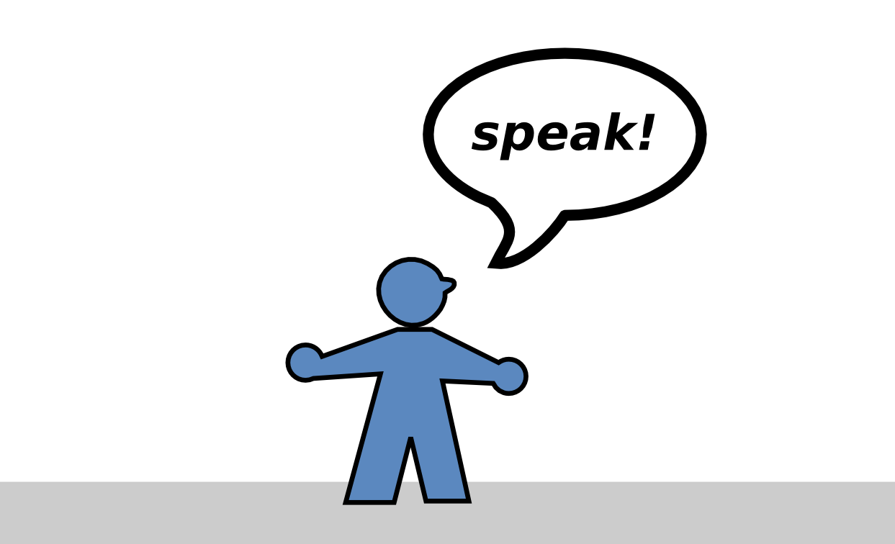

Public Speaking
===============

This manual contains projects to rehearse public speaking, meeting facilitation and other communication skills.
The projects include speech assignments, exercises and blueprints for workshops.

How to use the material?
------------------------

1. Find a supportive environment to practice speaking, e.g. a speaking club.
2. Give the speech for one of the projects.
3. Collect feedback by someone who has read the project description.

Easy Speech Projects
--------------------

.. toctree::
   :maxdepth: 1

   easy_speeches/things_you_like.md
   easy_speeches/introduce_yourself.md
   easy_speeches/present_an_article.md

Speaking Basics
---------------

.. toctree::
   :maxdepth: 1

   speaking_basics/structure.md
   speaking_basics/speech_purpose.md
   speaking_basics/rhetorical_devices.md
   speech_evaluation.md
   speaking_basics/evaluation.md

Facilitation Speaking Sessions
------------------------------

.. toctree::
   :maxdepth: 1

   meeting_facilitation/panel_discussion.md
   meeting_facilitation/icebreakers.md
   meeting_facilitation/chairperson.md
   meeting_facilitation/impromptu_moderator.md
   meeting_facilitation/ideas_impromptu.md
   meeting_facilitation/timer.md
   meeting_facilitation/filling_words.md
   meeting_facilitation/word_watcher.md
   meeting_facilitation/listener.md
   multi_cultural_awareness/whats_your_position.md
   
Speech Projects for Data Scientists
-----------------------------------

.. toctree::
   :maxdepth: 1

   data_speeches/lightning_talk.md
   data_speeches/live_demo.md
   data_speeches/educational_session.md
   data_speeches/selling_an_idea.md
   data_speeches/project_presentation.md

Other
-----

.. toctree::
   :maxdepth: 1

   faq.md

.. seealso::

   `List of Speaking Clubs in Berlin <https://topgunspeaking.com/reden-ueben-debattierclubs-rhetorik-clubs/>`__

----

.. topic:: Authors

   Jörg Würster, Barbara Strauß, Harald von Treuenfels, Jasmin Touati,
   Raimo Graf, Sascha Goldmann, Schorsch Tschürtz, Armando Cristofori,
   Barbara Bosch, Magdalena Rother, Ulrike Münzner and Kristian Rother.
   Edited by Kristian Rother.
   
.. topic:: License

   This work is licensed under a Creative Commons
   Attribution-Non-commercial-ShareAlike 4.0 International License.
   
   You may use, share and modify it under the same conditions, but not use
   it commercially. See
   `www.creativecommons.org <https://creativecommons.org>`__ for details.

   Individual chapters may fall under a less restrictive license.
