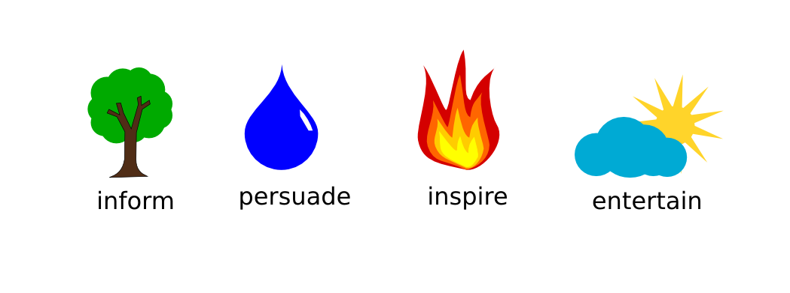

# The Speech Purpose

## Goal

Give a speech with a clear purpose you planned in advance.

## Background

### A speech is for the audience

Imagine your presentation ended a moment ago. You receive applause, leave the stage and that's it. Is it worth investing a lot of time into preparing? Did you consider that your audience is investing time as well? With an audience of 30 people, a 20-minute presentation accumulates to 10 hours. It is up to you to make this time well spent.

Therefore, the first step in speech preparation is to consider the interests of the audience. What kind of people will be there? What kind of expertise do they have? What are they interested in? What opinions are predominant? The more you are aware of the *value* you are giving your audience, the stronger the impactfo your speech will be.

### A speech is also for the speaker

Most speeches are not given out of altruism. Your speeches don't need to be an exception. Why would *you* like to give the speech? Frequent, honest answers include:

* *"Because I like to speak."*
* *"To advertise my project."*
* *"Because there is something people need to know about."*
* *"Because I have to."*

If it is to be a good speech, both you **and** your audience should see value in the speech. This is also called the **speech purpose**.

## What kind of speech purposes are there?

Most of the time, the speech purpose is one out of four: **inform**, **inspire**, **persuade** and **entertain**:

### Inform

Informative speeches follow a clear pattern: You know something that is useful or interesting to your audience. In principle it is sufficient to present this information clearly. OK, it is worth to spend a bit of effort to bring across the informative message in a pleasant way.

### Persuade

There are many reasons to persuade an audience: To promote an opinion, to get a job or to sell something. The trick is to make it obviously clear to the audience, how the sold *product*, *service* or *idea* benefits **them**.

### Inspire

*Inspiring* means motivating people to adopt a point of view, take action, feel as a group or simply feel more comfortable. To inspire successfully it is not enough to put facts on the table. Most of all, you need to engage your audience emotionally.

### Entertain

Sometimes the only reason to give a speech is to create a good mood. Successful entertainment not only means that people are laughing their heads off. It also means that people are stunned and think *"wow, good story!"* or clutch their handkerchiefs. If you ever had to speak as the last speaker on a long event you know why entertaining is an important speech purpose in itself.

Most of the time the speech purpose is one of the four above. As soon as you know which purpose your speech is going to have, writing the rest of the speech will be much easier.

### Summarize your speech in one sentence

Can you summarize your speech in a single sentence? Before writing the entire speech, try to find 5-10 words that accurately describe your speech purpose. As soon as this sentence contains some value for you and for your audience, you can start developing your entire speech from this statement.

The goal of this project is to decide for *one* speech purpose, and create a speech from it.

## Time

5-7 minutes

## Questions for evaluators

* Which purpose did the speech have in your opinions?
* Was this the purpose intended by the speaker?
* Which parts of the speech did support the speech purpose?
* Which parts of the speech distracted from the speech purpose?
* How could the speech purpose be made clearer?

## Authors

Based on text written by Magdalena Rother and Ulrike Münzner. Edited by Kristian Rother. Available under the conditions of the Creative Commons Attribution Non-commercial Share-alike License 4.0.
